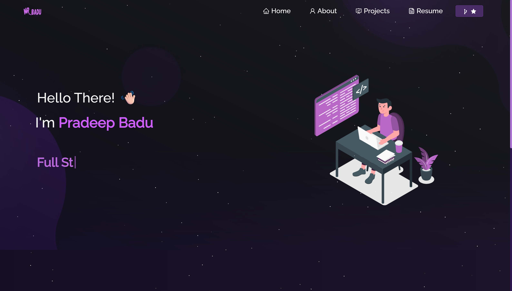

<h2 align="center">
  My Portfolio Website<br/>
  <a href="https://your-live-demo-link.com" target="_blank">View Live</a>
</h2>

<div align="center">
  
</div>

<br/>

<h3 align="center">
    🔹
    <a href="https://github.com/Mr-Pradeep-20/Portfolio/issues">Report Bug</a> &nbsp; &nbsp;
    🔹
    <a href="https://github.com/Mr-Pradeep-20/Portfolio/issues">Request Feature</a>
</h3>

---

## 🚀 About This Project

This is my personal **Portfolio Website** that showcases my projects, skills, and experiences.  
It is designed to be **responsive, modern, and fast**.  

---

## 🛠️ Built With

This project is developed using:

- **React.js**
- **Node.js**
- **Express.js**
- **CSS3**
- **VS Code**

---

## ✨ Features

- 📖 **Multi-Page Layout**
- 🎨 **Modern and customizable UI**
- 📱 **Fully Responsive for all devices**
- ⚡ **Fast and lightweight**

---

## 📦 Getting Started

Clone this repository. You will need `node.js` and `git` installed on your system.

### 🔹 Installation and Setup Instructions

1. Clone the repo:
   ```bash
   git clone https://github.com/Mr-Pradeep-20/Portfolio.git
